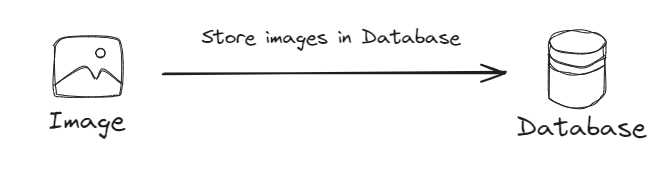

## Store Images into Database

#### This approach may affect the performance of our application due to increased database size and retrieval overhead.

### We need to use this option in the following situations :

- #### If we want more secure access due to database security mechanisms
- #### If we have small number of images, and less frequently reached images
- #### If our application requires complex querying and retrieval based on image metadata
